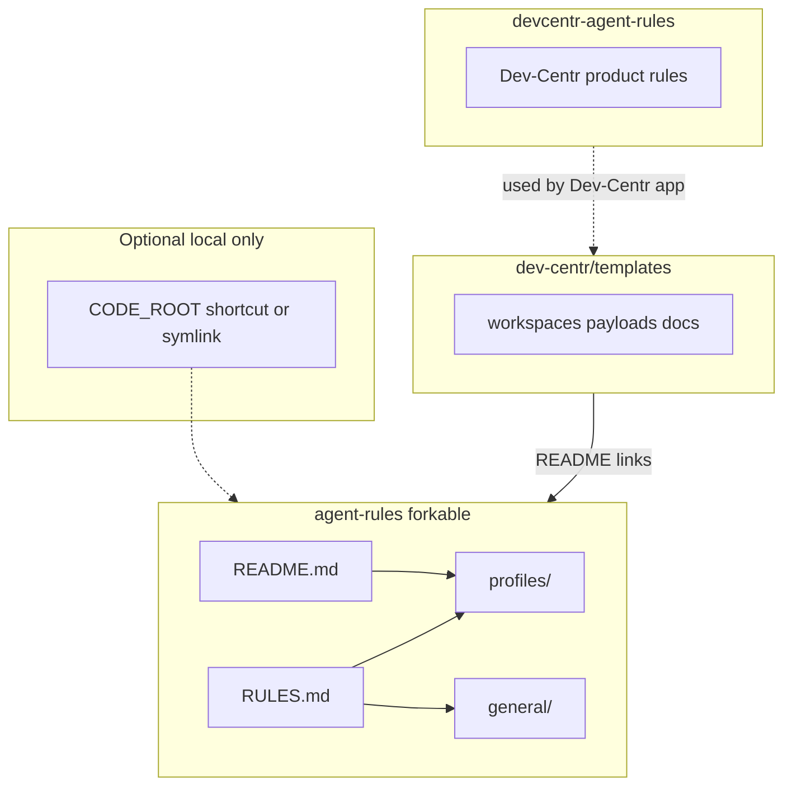

# Agent rules

Ryan's fork of [`dev-centr/agent-rules`](https://github.com/dev-centr/agent-rules). Contribute portable changes to [`dev-centr/agent-rules`](https://github.com/dev-centr/agent-rules). **This fork** ([`AMDphreak/agent-rules`](https://github.com/AMDphreak/agent-rules)) carries personal defaults on top of that story.

**Dev-Centr product behavior** (when the app acts on behalf of the user) does **not** live here. It belongs in [dev-centr/devcentr-agent-rules](https://github.com/dev-centr/devcentr-agent-rules).

## Architecture



- **agent-rules** (this repo family): forkable end-user instructions and profiles.
- **devcentr-agent-rules**: rules for when the Dev-Centr app acts on behalf of the user (separate repository).
- **templates**: project templates; README there links to forkable agent rules, not to personal copies.

## Quick start

1. Clone into your code hive, for example `$CODE_ROOT/github.com/<your-username>/.forks/agent-rules` (see `general/folder-schema.md`).
2. **Supported compose/watch:** install [`dev-centr/rules-manager`](https://github.com/dev-centr/rules-manager). Set `rules_repo_path` to this clone. Hostname → `laptop` / `desktop` lives in rules-manager config. Output: `$CODE_ROOT/agent-rules.composed.md` (never commit).
3. **Temporary path hack only:** a junction such as `…/AMDphreak/agent-rules` → `.forks/agent-rules` may exist for short paths; do not require it once rules-manager is configured.
4. Use `profiles/laptop.md` / `profiles/desktop.md` (constants) and `profiles/*.overlay.md` (machine-only bullets). Templates `my-laptop.md` / `my-desktop.md` remain for forks that rename profiles.
5. **`RULES.md` is written for the agent** and must stay **portable** (no hive/drive letters). Paste **only** `RULES.md` into Cursor **User Rules**. Cursor Settings User Rules **sync across machines**.
6. **This-machine overlay** (hive path, `CODE_ROOT`, overlay bullets): put in `%USERPROFILE%\.cursor\rules\machine.mdc` (`alwaysApply: true`). That home-dir file is local and does not sync. Do **not** paste `agent-rules.composed.md` or `profiles/*.overlay.md` into User Rules. rules-manager may still fill constants into the local composed file for disk consumers.

### Profile constants (your `profiles/*.md`)

| Constant | Required? | Purpose |
|----------|-----------|---------|
| `CODE_ROOT` | Yes | Root directory where you clone Git repos (see `general/folder-schema.md`). |
| `ENVIRONMENT` | Yes | `windows`, `mac`, or `linux` — selects `general/windows.md`, `general/mac.md`, or `general/linux.md`. |
| `GITHUB_USER` | No | Your username for path examples and org layouts. |
| `ISSUES_REPO` | No | Path to your `.issues` repo if you use that workflow. |

## Consolidated Rules (Fallback)

If your AI agent has difficulty reading multiple files from disk or refuses to follow the "1-step assembly" instructions in `MAIN.md`, paste **`RULES.md`** (portable) into User Rules. Machine constants stay in `%USERPROFILE%\.cursor\rules\`, not in a `file://` hive path.

## Pointing the agent at this repository

When you paste `RULES.md` into your agent and define `$AGENT_RULES_PATH`, you are commanding the AI to perform a batched semantic read of all foundational modules simultaneously using its native tools (e.g., `view_file`, `read_file`). This prevents multi-turn ping-pong delays and avoids the common truncation issues associated with traditional CLI `cat` output.

The agent will automatically pull:

1. `profiles/<infer-profile-name>.md`
2. `general/global.md`
3. `general/environment.md`
4. `general/<windows|mac|linux>.md`
5. `general/creator.md`
6. `general/folder-schema.md`
(and `general/documentation.md` when the task is docs). Heavy playbooks are Cursor skills — team `dev-centr/agent-rules/skills/CATALOG.md`.

Create **`$CODE_ROOT/machine.md`** (preferred) or legacy **`$CODE_ROOT/MEMORIES.md`** for workstation facts (see **Machine-local memories** below). Do not commit per-repo copies.

For **Dev-Centr automation** acting on behalf of the user, the product should load rules from [devcentr-agent-rules](https://github.com/dev-centr/devcentr-agent-rules), not from this forkable repo.

## Changelog

- Index: [`CHANGELOG.adoc`](CHANGELOG.adoc)
- Details: [`changelog-details/`](changelog-details/)
- Upstream (schema rename `RULES.md` → `user.md`, `MEMORIES` → `machine.md`, harness layer): https://docs.devcentr.org/agent-rules/changelog.html

## Machine-local memories

Prefer **`$CODE_ROOT/machine.md`** (upstream harness-neutral name). Legacy **`$CODE_ROOT/MEMORIES.md`** still works and stays gitignored. Harness wiring: **`$CODE_ROOT/harness.md`**. Cursor adapter: `%USERPROFILE%\.cursor\rules\machine.mdc` (does not sync).

The concrete `$CODE_ROOT` for this PC lives in Cursor `~/.cursor/rules` and `profiles/`, not in User Rules.

Committed template on this fork: link:MEMORIES.example.md[`MEMORIES.example.md`]. Upstream uses `machine.example.md` / `harness.example.md`.

Do **not** commit per-repo `MEMORIES.md` / `machine.md`. Project facts → `AGENTS.md` + docs.

Example line:

```text
Flutter SDK: `C:\flutter-sdk\flutter\bin` — refresh PATH if `flutter` missing (counter: 1)
```

## Relation to Dev-Centr templates

Project templates (workspaces, payloads, template docs) live in [dev-centr/templates](https://github.com/dev-centr/templates). That repo **links** to agent rules here; it should not embed a second copy of personal rules.

## License

Add a license file if you want this fork to be reusable by others.
